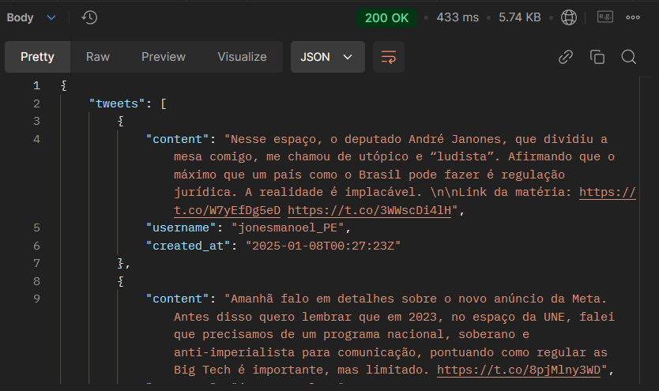
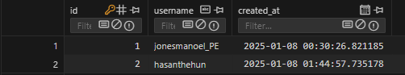

# Django Infboard API



## Description
The Django Infboard API is a service that collects tweets and interacts with GPT using the official Twitter and OpenAI APIs. The API is designed to serve the Vue.js front end available at: https://github.com/tdiascontato/vue-infboard


The system is configured to run with Docker and uses an SQLite database. Mocked information is provided to visualize the project without the official API keys.
An initial process for populating the database would be to use influencer search, i.e., using the search input in the front-end repository with the username of a news portal or influencer, or the endpoints:
- `POST localhost:8000/api/recent-tweets/`
- `POST localhost:8000/api/influencer-save/`

Other API endpoints:
- `GET localhost:8000/api/numbers-stats-general/`
- `GET localhost:8000/api/influencer-rank/`
- `GET localhost:8000/api/tweets/`

Future features include implementing typed searches by categories, creating dictionaries, and implementing Redis to avoid unnecessary searches to the official API.

#### SQLite DB:


## Installation
### Using Docker
1. Clone the repository:
    ```bash
    git clone https://github.com/tdiascontato/django-infboard.git
    ```

2. Access the developer portal X: https://developer.x.com/en
3. Create a Project APP and collect the keys: `API_KEY`, `API_KEY_SECRET`, `ACCESS_TOKEN`, `ACCESS_TOKEN_SECRET`, `BEARER_TOKEN`.
4. Put the keys in the `.env` file in the repository.
5. Access your profile on the OpenAI platform: https://platform.openai.com/docs/overview and get the `SECRET KEY` to put in the `.env` file.

6. Navigate to the project directory:
    ```bash
    cd django-infboard
    ```
7. Build the Docker image:
    ```bash
    docker build -t django-infboard .
    ```
8. Run the Docker container:
    ```bash
    docker run -p 8000:8000 django-infboard
    ```

### Without Docker
1. Clone the repository:
    ```bash
    git clone https://github.com/tdiascontato/django-infboard.git
    ```
2. Access the developer portal X: https://developer.x.com/en
3. Create a Project APP and collect the keys: `API_KEY`, `API_KEY_SECRET`, `ACCESS_TOKEN`, `ACCESS_TOKEN_SECRET`, `BEARER_TOKEN`.
4. Put the keys in the `.env` file in the repository.
5. Navigate to the project directory:
    ```bash
    cd django-infboard
    ```
6. Install the dependencies:
    ```bash
    pip install -r requirements.txt
    ```
7. Run the migrations:
    ```bash
    cd twitter_scraper
    python manage.py makemigrations
    ```
8. Apply the migrations:
    ```bash
    python manage.py migrate
    ```
9. Start the server:
    ```bash
    python manage.py runserver
    ```

## Contribution
1. Fork the project.
2. Create a new branch:
    ```bash
    git checkout -b my-new-feature
    ```
3. Make your changes and commit:
    ```bash
    git commit -m 'Add new feature'
    ```
4. Push to the remote repository:
    ```bash
    git push origin my-new-feature
    ```
5. Open a Pull Request.

## License
This project is licensed under the MIT License. See the [LICENSE](LICENSE) file for more details.

## Contact
For more information, contact [your-email@example.com](mailto:your-email@example.com).
